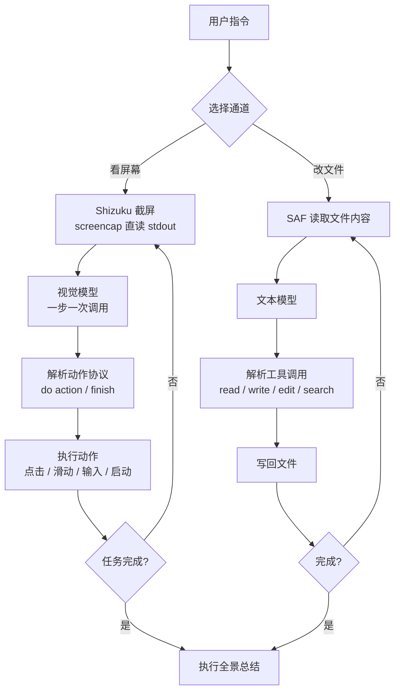

<div align="center">


# 豆糕 DouGao

**一句话，让 AI 替你操作手机；也能绕过屏幕，直接读写文件。**

一个跑在手机本地的安卓 AI Agent。基于视觉语言模型看懂屏幕，自动点按、输入、滑动；
同时提供一条更快的通道 —— 选中文件夹，AI 直接读取并改写内容，全程不碰屏幕。

[](https://developer.android.com)
[](https://kotlinlang.org)
[](https://developer.android.com/jetpack/compose)
[](https://developer.android.com)
[](LICENSE)

</div>

---

## 目录

- [它是什么](#它是什么)
- [功能特性](#功能特性)
- [它是怎么工作的](#它是怎么工作的)
- [安装](#安装)
- [使用](#使用)
- [兼容性](#兼容性)
- [自行编译](#自行编译)
- [常见问题](#常见问题)
- [致敬](#致敬)
- [开源协议](#开源协议)

---

## 它是什么

市面上的手机 AI 助手，大多靠"看屏幕 → 点屏幕"来干活。这套流程能解决很多问题，但有两个天生的短板：**慢**，以及**在需要改文件的时候格外笨重** —— 为了改一行配置，要把文件管理器打开、定位、点进去、长按、粘贴，一路点十几下。

豆糕把这两件事拆成了两条独立的通道：

| 通道 | 原理 | 适合什么 |
|---|---|---|
| **看屏幕操作** | 截屏 → 视觉模型理解界面 → 输出坐标与动作 → 执行 | 操作 App、点外卖、发消息、填表单 |
| **文件直改** | 选择文件夹 → 读取文件内容 → 直接改写 → 写回 | 改配置、批量替换文本、整理文档 |

第二条通道是豆糕相对同类项目最大的差异点：**不需要操作屏幕，不需要点击，模型拿到的是文件的真实内容而不是一张截图**，因此更快、更准，也不怕界面改版。

---

## 功能特性

### 手机自动化（看屏幕）

- **一句话完成任务** —— "打开美团点一份猪脚饭"，剩下的交给它
- **执行全景折叠卡** —— 发出指令后界面折叠成一张卡片，运行中转圈、结束后打勾；点开可以看到每一步在"想什么"、做了什么操作、成功还是失败；跑完自动给出总结
- **自适应节奏** —— 不同动作等待不同时长（点击 1.1 秒、输入 0.9 秒、启动应用 1.8 秒），不再无脑死等
- **截图复用** —— 上一步动作后的画面直接作为下一步输入，截图次数减半

### 文件直改（不碰屏幕）

- 在系统文件选择器里选一个**文件夹**或**单个文件**，授权后即可长期使用
- AI 直接读取真实内容 → 直接改写 → 写回，**全程零点击**
- 支持批量处理："把这个目录下所有 txt 里的『张三』改成『李四』"
- **编码自动识别** —— UTF-8 与 GBK 自动判别，写回时保持原编码，中文不乱码
- **文档解析** —— `docx / xlsx / pptx` 可直接抽取文字内容（自研解析，不依赖任何重型库）
- **安全兜底** —— 删除文件前必定二次确认；单文件超过 20 MB 有保护；`..` 与绝对路径被拦截

### 模型与配置

- **多模型档案** —— 可以添加任意多个模型，每个独立保存服务商、API Key、Base URL
- **输入框处切换** —— 不必进设置，输入框上方直接切模型
- **思考程度可调** —— 低 / 中 / 高三档，输入框处直接调

| 档位 | 行为 |
|---|---|
| 低 | 关闭思考链，最快、最省 token，适合简单操作 |
| 中 | 适度思考，速度与质量平衡（默认） |
| 高 | 完整思考链，适合多步复杂任务 |

思考程度做了**跨厂商安全映射**：Qwen3 系走 `enable_thinking` + `thinking_budget`，o 系列 / GPT-5 走 `reasoning_effort`，GLM 系走 `thinking.type`；遇到不认识这类参数的接口会自动降级为最小请求体重试，**不会因为接口不支持而报错**。

### 隐私

- API Key 存放于 `EncryptedSharedPreferences`（Android 系统级加密存储）
- 已移除原项目的云端崩溃上报（Firebase），**日志只留在本机**
- 没有账号系统，没有服务端，你的数据不经过任何第三方服务器（除你自己配置的模型 API）

---

## 它是怎么工作的



**核心设计取舍：**

| 决策 | 原因 |
|---|---|
| **一步只调一次模型** | 官方 AutoGLM 范式。一次输出同时包含「思考」与「动作」，相比"规划者 + 执行者 + 反思者"三轮调用，模型往返次数降到 1/3，这是速度的主要来源 |
| **截屏走 stdout 直读** | 不落盘、不碰文件权限、不受 SELinux 拦截。落盘再读的老路在非 Root 设备上会稳定失败 |
| **纯文本协议解析，不依赖原生 function calling** | 兼容任意 OpenAI 兼容接口，不被厂商 SDK 绑架 |
| **文件通道用 SAF** | 无需存储权限、无需 Root，用户授权哪个目录就只能碰哪个目录 |
| **自研 Office 解析** | Apache POI 在 Android 上跑不起来（缺 StAX），自己用 `ZipInputStream` + 正则抽 XML 反而更稳更小 |

---

## 安装

### 方式一：直接下载（推荐）

到 [Releases](../../releases) 下载最新的 `豆糕_x.y.z.apk`，传到手机上安装即可。

### 方式二：自己编译

见 [自行编译](#自行编译)。

### 首次使用前置条件

1. **安装 Shizuku**（看屏幕模式必需）
   从 [Shizuku 官方仓库](https://github.com/RikkaApps/Shizuku/releases) 下载安装，并按应用内指引启动服务
   （Android 11+ 可用无线调试启动，无需电脑）

2. **授予权限**
   - Shizuku 权限（用于截屏与模拟点击）
   - 悬浮窗权限（用于显示执行状态）
   - 通知权限（部分系统需要）

> 只使用**文件直改**功能的话，可以不装 Shizuku —— 这条通道完全基于系统文件选择器，不需要任何特殊权限。

---

## 使用

### 配置模型

1. 打开豆糕 → 设置 → **模型管理** → 右上角 **＋**
2. 选择服务商（或自定义）→ 填入 API Key → 必要时修改 Base URL
3. 点「从 API 获取可用模型」拉取模型列表，或手动填写模型名
4. 保存。可以重复添加多个模型

支持任意 **OpenAI 兼容**接口（`/chat/completions`），包括但不限于智谱 GLM、通义千问、DeepSeek、Kimi、OpenAI、以及各类自建中转。

### 看屏幕模式

1. 回到首页，在输入框上方选择**模型**和**思考程度**
2. 输入要完成的事，例如：
   - `打开美团，点一份猪脚饭`
   - `把刚才微信里那张图片保存到相册`
   - `打开设置，把屏幕亮度调到最高`
3. 发送后会出现**执行全景卡片**

   ```
   ┌─────────────────────────────────────────┐
   │  ◐  正在执行 · 第 3 步            ▾    │
   ├─────────────────────────────────────────┤
   │  ✓  第 1 步  启动「美团」         成功  │
   │  ✓  第 2 步  点击搜索框           成功  │
   │  ◐  第 3 步  输入「猪脚饭」       执行中 │
   └─────────────────────────────────────────┘
                   （点击 ▾ 展开每步的思考）
   ```

4. 任务完成后自动切回豆糕，卡片下方给出**总结**

### 文件直改模式

1. 切换到 **文件** 页签
2. 点「添加文件夹」或「添加文件」，在系统选择器里选一个目录并授权
3. 在底部输入框描述需求，例如：
   - `把 config 目录下所有 ini 里的端口号改成 8080`
   - `把这篇文档里的「公司」全部替换成「集团」`
   - `给 README.md 补一段安装说明`
4. 豆糕会读取内容、改写、写回，**屏幕上不需要任何点击**

> 想换目录随时切回来重新授权，已授权的工作区会一直保留在列表里。

---

## 兼容性

| 项目 | 值 |
|---|---|
| 最低系统 | **Android 7.0（API 24）** |
| 目标系统 | Android 14（API 34） |
| 支持架构 | 全平台（无 native 依赖） |
| 安装包体积 | 约 6.4 MB |
| 需要 Root | **不需要** |
| 需要电脑 | **不需要**（Shizuku 可用无线调试启动） |

`minSdk 24` 不是随手定的：Shizuku 依赖库本身要求 API ≥ 24，再往下调会在运行期崩溃。24 已覆盖约 98% 的在用设备。

---

## 自行编译

**环境要求**：JDK 17、Android SDK（platform 34 + build-tools 34.0.0）、Gradle 8.2（用仓库自带的 wrapper 即可）

```bash
git clone https://github.com/<你的用户名>/dougao.git
cd dougao

# 指定 SDK 路径
echo "sdk.dir=/path/to/android-sdk" > local.properties

# 编译
./gradlew assembleRelease
# 产物：app/build/outputs/apk/release/app-release.apk
```

**关于签名**：仓库**不包含**签名密钥。`app/build.gradle.kts` 会从 `local.properties` 读取以下字段，读不到就产出未签名包（不影响编译）：

```properties
dougao.storePassword=你的密码
dougao.keyAlias=你的别名
dougao.keyPassword=你的密码
# 可选，默认 keystore/dougao.jks
# dougao.keystore=相对项目根目录的路径
```

要生成一份自己的密钥：

```bash
keytool -genkeypair -v -keystore keystore/dougao.jks \
  -alias dougao -keyalg RSA -keysize 2048 -validity 10950
```

> ⚠️ Android 编译工具链对**中文路径**支持不佳，若项目路径含中文，可能出现 `MalformedInputException`。
> 解决办法是做一次盘符映射（Windows 下 `subst X: D:\你的中文路径`），然后在映射盘里编译。

**技术栈**：Kotlin 1.9.20 · Jetpack Compose (Material 3) · OkHttp 4.12 · Shizuku API 13.1.5 · AGP 8.2.0 · Gradle 8.2

---

## 常见问题

**Q：一定要 Root 吗？**
不需要。豆糕通过 Shizuku 获取 shell 级权限，Shizuku 本身在非 Root 设备上也能跑（Android 11+ 用无线调试启动）。

**Q：为什么截屏会失败？**
截屏依赖 Shizuku 服务处于运行状态。连续失败 3 次会明确报错并停止，不会拿黑屏硬撑。请在 Shizuku 应用里确认服务已启动、且豆糕已获授权。

**Q：任务做到一半就停了？**
豆糕要求「模型声明完成」+「确实成功执行过动作」两个条件同时满足才收工，模型第一次声称完成时还会被要求再确认一次。若仍出现提前结束，通常是模型能力不足 —— 换一个更强的模型，或把思考程度调到「高」。

**Q：支持本地模型吗？**
任何暴露 OpenAI 兼容接口的服务都能接（如 Ollama、LM Studio、vLLM），在模型管理里选「自定义」并填 Base URL 即可。

**Q：会偷传我的数据吗？**
不会。没有账号系统，没有自建服务端，不含任何统计 SDK。你的截图与文件内容只会发给你自己配置的那个模型接口。

---

## 致敬

豆糕是站在一群优秀的开源项目肩膀上做出来的。**没有它们，就没有豆糕。**

特别感谢以下项目（排名不分先后）：

### 作为基础与蓝本

**[Turbo1123/roubao](https://github.com/Turbo1123/roubao)** —— 肉包

豆糕的**主要功能蓝本与代码基础**。看屏幕自动操作手机、UI 框架、配色主题、界面骨架全部来源于此。豆糕是在它的二次开发中长出来的。

**[AAswordman/Operit](https://github.com/AAswordman/Operit)** —— Operit

「选择文件夹 / 文件 → 直接读取修改」这一能力的**思路来源**。豆糕据此做了更轻量的实现：不按整库加载，按需读取，直接改写。

### 作为执行范式与工程实现参考

| 项目 | 借鉴了什么 |
|---|---|
| **[zai-org/Open-AutoGLM](https://github.com/zai-org/Open-AutoGLM)** | **官方单步执行范式**。豆糕的动作协议（`do(action=...)` / `finish(message=...)`）、提示词结构、坐标归一化、一步一次模型调用的循环设计，都对齐了它的实现。这是速度提升 3 倍的根本原因 |
| **[sidhu-master/AndroidAutoGLM](https://github.com/sidhu-master/AndroidAutoGLM)** | **安卓端的落地细节**。`Shizuku.newProcess("screencap -p")` 直读 stdout 的截屏方式、"取最后一个 `do`" 的容错解析、启动应用的三级兜底、广播 IME 输入中文 —— 这些都是踩过坑才留下的写法 |
| **[looper42/mobile_agent](https://github.com/looper42/mobile_agent)** | **执行过程可视化的设计**。状态分层、工具调用分组折叠、时间线 stepper 的呈现方式，豆糕的「执行全景」卡片参考了它的思路 |
| **[ZG0704666/Aries-AI](https://github.com/ZG0704666/Aries-AI)** | **工程细节**。截图缓存与节流、悬浮窗引用计数隐藏、自适应等待参数表、上下文裁剪策略 |

### 依赖的开源项目

- **[RikkaApps/Shizuku](https://github.com/RikkaApps/Shizuku)** —— 免 Root 的 shell 级权限方案，是豆糕能够操作屏幕的前提
- **Jetpack Compose / AndroidX** —— UI 框架
- **[Square OkHttp](https://github.com/square/okhttp)** —— 网络请求

以及所有为 Android 开源生态做出贡献的开发者。

---

## 开源协议

本项目基于 [MIT License](LICENSE) 开源。

由于基于 `roubao` 二次开发，LICENSE 中保留了原项目的版权声明：

```
MIT License

Copyright (c) 2025 Roubao Team   (原项目 roubao)
Copyright (c) 2026 DouGao Team    (本项目 豆糕)
```

你可以自由地使用、修改、分发本项目，包括商用，只需保留原始版权声明。

---

## 免责声明

- 本项目仅供学习与研究使用，请遵守所在地区的法律法规
- 使用自动化功能操作第三方 App 可能违反其用户协议，风险由使用者自行承担
- 开发者不对因使用本软件产生的任何直接或间接损失负责

<div align="center">

**如果豆糕对你有帮助，欢迎点个 ⭐ Star**

</div>
